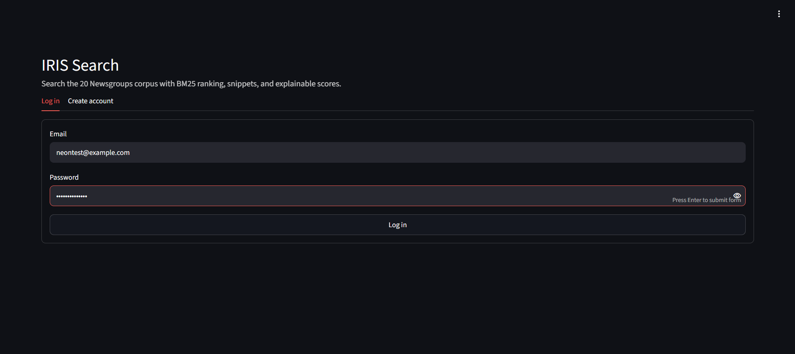
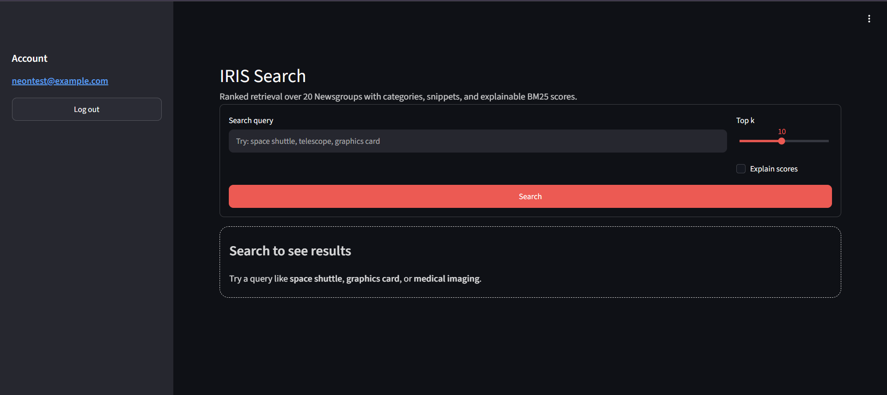
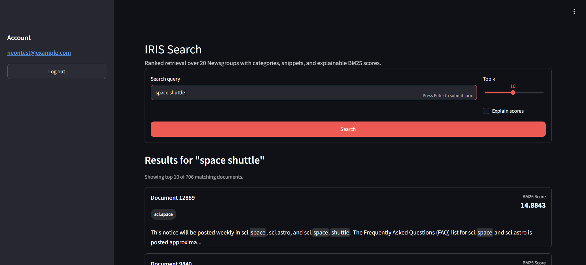
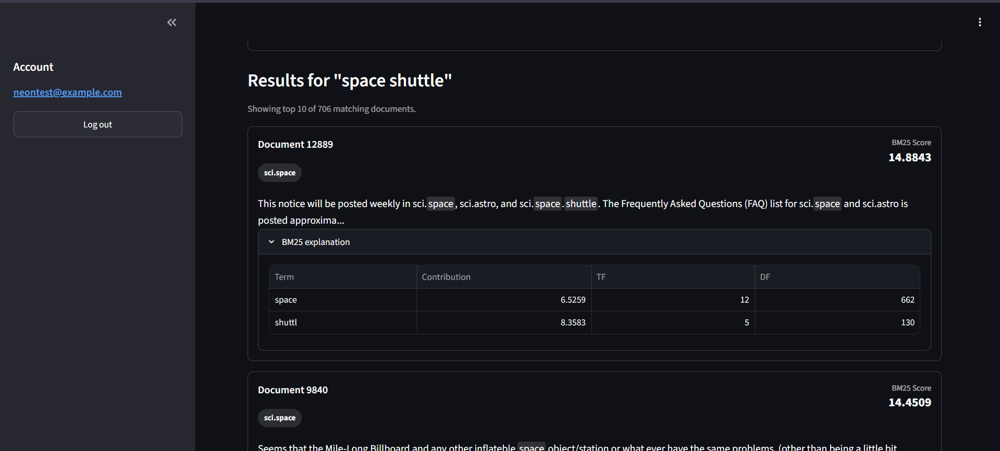

# IRIS Search Engine

[](https://www.python.org/)
[](https://fastapi.tiangolo.com/)
[](https://www.postgresql.org/)
[](https://www.docker.com/)
[](https://streamlit.io/)
[](https://render.com/)
[](https://neon.tech/)
[](LICENSE)

IRIS is an information retrieval project that indexes the 20 Newsgroups corpus, ranks documents with BM25, and serves an explainable search experience through a FastAPI backend and Streamlit frontend.

## Live Demo

| Service | URL |
| --- | --- |
| Backend API Docs | https://iris-abi9.onrender.com/docs |
| Frontend | https://iris-frontend-gna3.onrender.com |

> The backend is hosted on Render's free tier. If the frontend does not respond immediately, first open the API Documentation link and wait 30–60 seconds for the backend to wake up, then refresh the frontend.

## Project at a Glance

| Item | Value |
| --- | --- |
| Dataset | 20 Newsgroups |
| Documents Indexed | 18,846 |
| Vocabulary Size | 72,334 |
| Posting Records | 1,174,747 |
| Ranking Algorithm | BM25 |
| Authentication | JWT |
| Backend | FastAPI |
| Database | Neon PostgreSQL |
| Deployment | Render |

## Features

- JWT-protected document search
- BM25 ranking over a persisted inverted index
- Query-aware previews and category labels
- Explainable term contribution breakdowns
- FastAPI backend with PostgreSQL persistence
- Streamlit frontend for demos

## Architecture Overview

IRIS uses a Streamlit frontend, a FastAPI backend, JWT-protected search endpoints, and an in-memory BM25 index rebuilt from PostgreSQL at startup. The full diagrams live in [docs/architecture/README.md](docs/architecture/README.md).

## Tech Stack

| Layer | Tools |
| --- | --- |
| API | FastAPI, Pydantic |
| Database | PostgreSQL, SQLAlchemy 2.x, Alembic |
| Search | BM25, in-memory inverted index |
| Auth | JWT, PyJWT |
| UI | Streamlit |
| DevOps | Docker, Docker Compose, Render |
| Cloud DB | Neon PostgreSQL |

## Folder Structure

```text
iris/
├── app/                  # FastAPI app, auth, documents, indexing, search
├── alembic/              # Alembic environment and migrations
├── docs/
│   ├── architecture/     # Mermaid architecture documentation
│   └── screenshots/      # Project screenshots
├── scripts/              # Ingestion and index persistence scripts
├── streamlit_app/        # Streamlit frontend
├── tests/                # Automated test suite
├── Dockerfile
├── docker-compose.yml
├── render.yaml
└── README.md
```

## Local Development

### Prerequisites

- Python 3.12+
- PostgreSQL 16+

### Backend

```bash
git clone https://github.com/S-Kamath-01/iris.git
cd iris
python -m venv venv
source venv/bin/activate
pip install -r requirements.txt
cp .env.example .env
alembic upgrade head
uvicorn app.main:app --reload
```

### Frontend

```bash
cd streamlit_app
pip install -r requirements.txt
API_BASE_URL=http://localhost:8000 streamlit run app.py
```

## Docker Setup

```bash
docker compose up --build
```

This starts the local PostgreSQL container and the FastAPI backend with the bundled database by default.

## Deployment (Render + Neon)

- Render hosts the FastAPI backend and Streamlit frontend as separate services.
- Neon provides managed PostgreSQL.
- The only production database setting is `DATABASE_URL`.
- Set `DATABASE_URL` manually in Render to the Neon PostgreSQL connection string with `sslmode=require`.

## API Endpoints

| Method | Path | Purpose |
| --- | --- | --- |
| POST | `/api/v1/auth/register` | Create a user account |
| POST | `/api/v1/auth/login` | Return a JWT access token |
| GET | `/api/v1/search/` | Search documents with optional explanations |
| GET | `/api/v1/documents/` | List documents |
| GET | `/health` | Health check |

Example search request:

```bash
curl "http://localhost:8000/api/v1/search/?q=space+shuttle&top_k=5&explain=true" \
  -H "Authorization: Bearer <token>"
```

## Project Workflow

1. Ingest the 20 Newsgroups dataset into PostgreSQL.
2. Build the inverted index and persist terms/postings.
3. Persist document token counts and index metadata.
4. Start the API, which rebuilds `SearchContext` from PostgreSQL.
5. Use the Streamlit UI to authenticate and search.

## Screenshots

### Login



### Search Interface



### Search Results



### BM25 Explainability



## Future Improvements

- Search history
- Saved searches
- Autocomplete
- Query suggestions
- Synonym expansion
- Semantic search
- Hybrid BM25 + vector retrieval
- Redis caching
- Async indexing
- Rate limiting

## License

This project is licensed under the MIT License. See [LICENSE](LICENSE).
