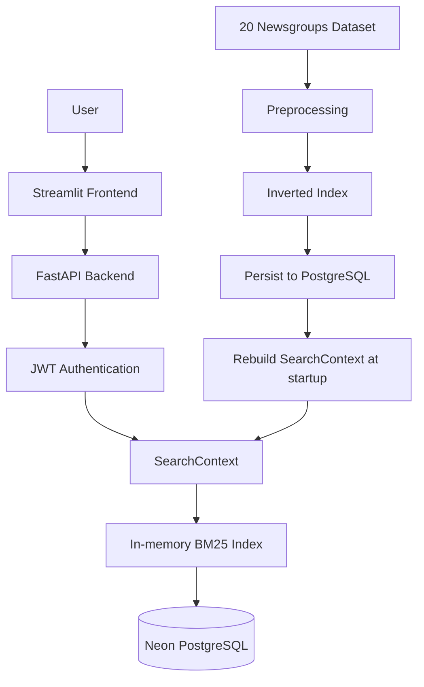

# Architecture

## Notes

- Search is served from an in-memory index rebuilt at application startup.
- PostgreSQL stores the durable source data, index metadata, and authentication records.
- Neon is used as managed PostgreSQL only; no Neon-specific SDKs are required.